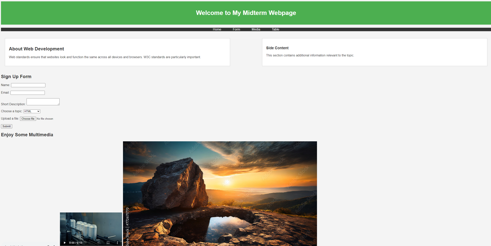
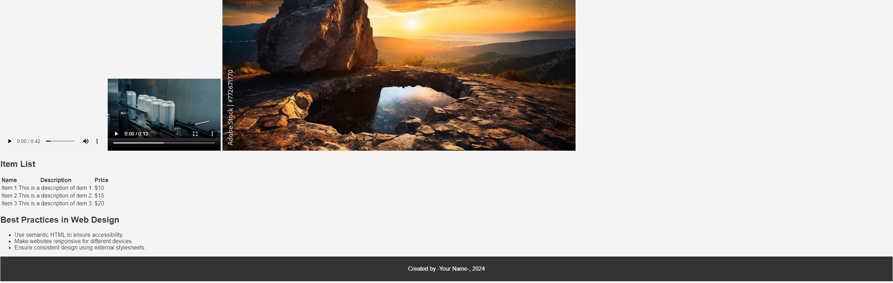
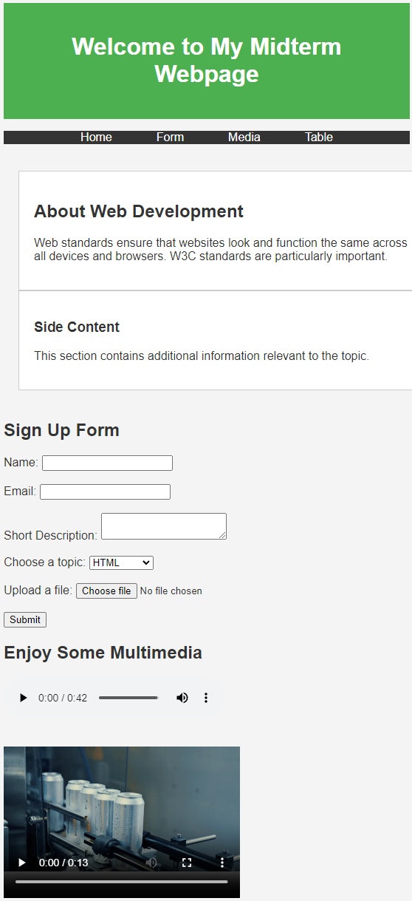
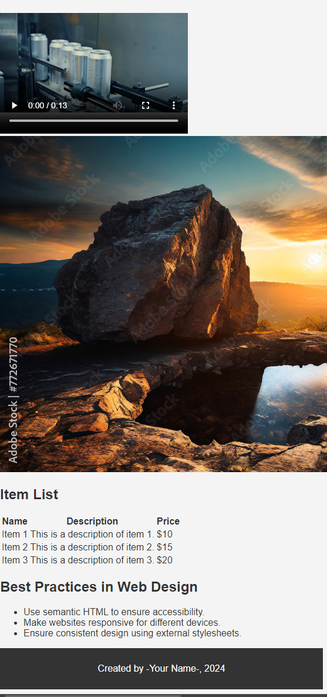

# Web Client Development - Midterm Exam

This template repository is the starter project for Web Client Development Midterm Exam. Written in HTML, CSS and JavaScript.

### Instructions

- Internet access and class notes are allowed during the exam except the use of any sort of AI.
- Students must **submit the exam via GitHub, simply by pushing back to the same repository they cloned this handout.**
- The teacher will not answer questions during the exam.
- Students must keep silent during the exam time.
- It is the teacher’s responsibility to identify language errors. If such errors are found, the teacher has the right to apply a penalty of up to 20% of the grade. (PIEA – Article 5.7)
- Plagiarism, any attempt at plagiarism or complicity in plagiarism during an evaluation representing 20% and more of the final grade, will result in a course failure. (PIEA – Article 5.16)

### Question(s)

### Midterm Exam: Web Client Development

**Total Weight: 30% of Final Grade**  
**Duration:** 3 hours  
**Instructions:** You are required to develop a webpage from scratch, following the given tasks. Use best practices in web development. Please note that while you may reference online materials, the project must be your own work. Avoid copying exact code from external sources or AI tools.

---

#### Question 1: HTML Structure and Layout (20 marks)
Design a webpage with the following requirements:
- **Structure**: Create a well-structured HTML document. Include appropriate meta tags, title, and sections like header, main, and footer.
- **Layout**: Implement a basic layout with a header, a navigation bar with three links, a main content section with two columns, and a footer.
- **Responsive Design**: Ensure the layout adapts to different screen sizes by using media queries.

**Evaluation:**
- Proper HTML structure (5 marks)
- Layout implementation (5 marks)
- Use of semantic tags (5 marks)
- Responsive design (5 marks)

---

#### Question 2: Interactive Form (25 marks)
Create a form that includes the following:
- Input fields for the user’s name, email, and a short description.
- A dropdown (select) element to choose a topic of interest.
- A file upload input.
- Validation: Ensure all fields are required and use basic HTML5 validation.
- Add a submit button with a hover effect.

**Evaluation:**
- Correct form structure and inputs (10 marks)
- Form validation (5 marks)
- Dropdown and file upload functionality (5 marks)
- CSS hover effect on submit button (5 marks)

---

#### Question 3: Applying CSS3 and Visual Enhancements (25 marks)
Apply CSS to style your webpage:
- **Colors and Fonts**: Use external CSS to style the background, text color, and fonts for different sections.
- **Box Model**: Implement margins, padding, and borders for the main elements of the page.
- **2D Transformation & Animation**: Add a hover animation for the navigation links that changes the color and size when hovered.

**Evaluation:**
- Use of external CSS and correct styling of elements (10 marks)
- Application of the box model (5 marks)
- Use of 2D transformations and animations (10 marks)

---

#### Question 4: Media Integration and Accessibility (15 marks)
Enhance your webpage by embedding multimedia:
- **Audio/Video**: Include either an audio or video element on your webpage. Ensure proper controls are visible.
- **Accessibility**: Make sure your webpage includes alt text for images and appropriate aria attributes for navigation and forms.

**Evaluation:**
- Correct embedding of media (5 marks)
- Use of controls and attributes for media elements (5 marks)
- Accessibility features (5 marks)

---

#### Question 5: Tables and Lists (15 marks)
In a new section of your webpage, create:
- A table that lists at least three items with details (name, description, and price).
- A bulleted or numbered list that presents at least three key points about web design best practices.
- Style the table and list using CSS.

**Evaluation:**
- Proper table structure and content (5 marks)
- Correct list implementation (5 marks)
- CSS styling for table and list (5 marks)

---

### Total: 100 Marks

---

### Evaluation Grid

| Criteria                                     | Points |
|----------------------------------------------|--------|
| **Question 1: HTML Structure and Layout**     | 20     |
| Proper HTML structure                        | 5      |
| Layout implementation                        | 5      |
| Use of semantic tags                         | 5      |
| Responsive design                            | 5      |
| **Question 2: Interactive Form**              | 25     |
| Correct form structure and inputs            | 10     |
| Form validation                              | 5      |
| Dropdown and file upload functionality       | 5      |
| CSS hover effect                             | 5      |
| **Question 3: CSS3 & Visual Enhancements**    | 25     |
| Use of external CSS                          | 10     |
| Application of the box model                 | 5      |
| 2D transformations and animations            | 10     |
| **Question 4: Media Integration & Accessibility** | 15  |
| Correct embedding of media                   | 5      |
| Use of controls and attributes for media     | 5      |
| Accessibility features                       | 5      |
| **Question 5: Tables & Lists**                | 15     |
| Proper table structure and content           | 5      |
| Correct list implementation                  | 5      |
| CSS styling for table and list               | 5      |

### Screenshots of a sample solution

